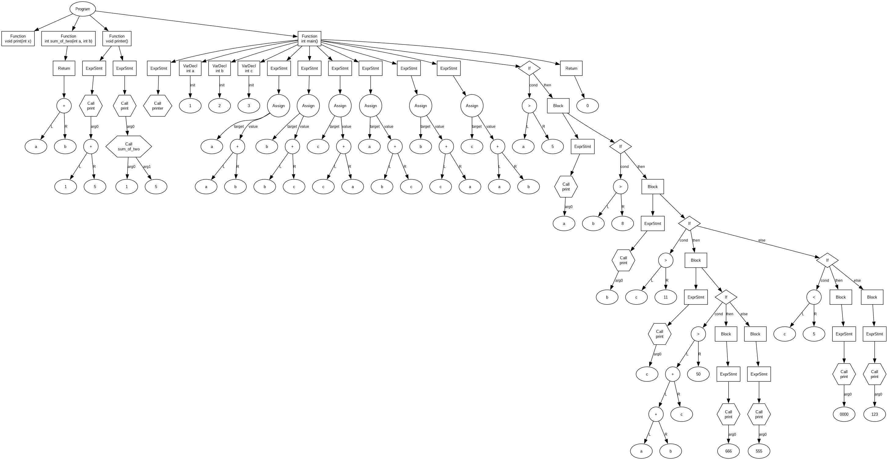

# Scy Laungage

## Быстрый старт

С зависимострями можно ознакомится тут: https://github.com/kxigor/cpp-project-template

```bash
cmake --preset dev-debug-asan
cmake --build --preset dev-debug-asan
ctest --preset dev-debug-asan
./build/dev-debug-asan/app/app > dot.dot
dot -Tpng dot.dot -o out.png
```

## Example
```scy
void print(int x) {}

int sum_of_two(int a, int b) {
  return a + b;
}

void printer() {
  print(1 + 5);
  print(sum_of_two(1, 5));
}

int main() {
  printer();
  
  int a = 1;
  int b = 2;
  int c = 3;
  a = a + b;
  b = b + c;
  c = c + a;
  a = b + c;
  b = c + a;
  c = a + b;
  if (a > 5) {
    print(a);
    if (b > 8) {
      print(b);
      if(c > 11) {
        print(c);
        if(a + b + c > 50) {
          print(666);
        } else {
          print(555);
        }
      } else if (c < 5) {
        print(0000);
      } else {
        print(123);
      }
    }
  }
  return 0;
}
```

